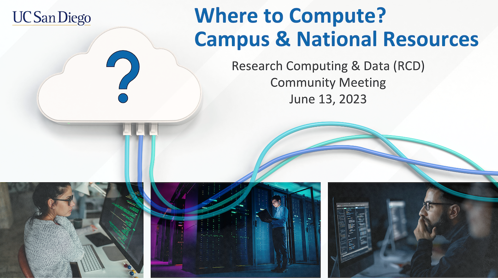

# Where to Compute?
**June 13, 2023, 2:00 p.m. PDT**

{
  "name": "UCSD RCD Community Meeting: Where to Compute? Campus and National Resources",
  "description": "Picking a compute resource is more than just a matter of finding enough cores and memory. During this meeting, we'll discuss some facets to consider when moving your research computing needs outgrow your laptop.  More information: [url]https://ucsd-rcd.github.io/meetings/events/2023-06-13-WhereToCompute.html[/url]  Zoom link: https://ucsd.zoom.us/j/96110457841",
  "startDate":"2023-06-13",
  "endDate":"2023-06-13",
  "startTime":"14:00",
  "endTime":"15:00",
  "timeZone":"America/Los_Angeles",
  "location":"https://ucsd.zoom.us/j/96110457841",
  "options": [
      "Apple",
      "Google",
      "iCal",
      "Microsoft365",
      "Outlook.com"
  ]
}

## Description

Picking a compute resource is more than just a matter of finding
enough cores and memory. During this meeting, we'll discuss some
facets to consider when moving your research computing needs outgrow
your laptop. How productive you'll be on a compute resource can be
impacted by several factors, like the software applications to be run,
the data you're working with, the level and types of support, and
whether the resource is paid vs. "free" (allocated). The presenters
will share recommendations on selecting compute resources, a list of
some campus and national resources, and a few examples from other UCSD
researchers.

## Agenda

* What to consider before picking a resource
  * Software
  * Data
  * Cost: time or money
  * Project parameters
* Categorizing resources and aligning with your needs
* Campus and national resources
* A few use cases

## Topics

* High-performance computing
* High-throughput computing
* Cloud computing

## Location

Zoom 
[https://ucsd.zoom.us/j/96110457841](https://ucsd.zoom.us/j/96110457841)

Meeting ID: 961 1045 7841

## Host & Presenters

* Kim Thomas (UCSD Research IT)
* Rick Wagner (UCSD Research IT)

## Resources

### Campus

* [Research
  Cluster](https://ucsdcollab.atlassian.net/wiki/spaces/TWT/pages/17072279/UCSD+Research+Cluster)
* [Triton Shared Computing Cluster (TSCC)](https://www.sdsc.edu/services/hpc/tscc/index.html)
* Cloud Computing at UCSD
  * [Previous Meeting](https://ucsd-rcd.github.io/meetings/events/2022-08-09-Commercial-Cloud-Research-Activity.html)
  * [Blink](https://blink.ucsd.edu/technology/cloud/index.html)

### National

* [ACCESS](https://access-ci.org)
  * [SDSC Expanse](https://www.sdsc.edu/services/hpc/expanse/)
  * [TACC Frontera](https://tacc.utexas.edu/systems/frontera/)
* [Open Science Grid
  OSPool](https://portal.osg-htc.org/documentation/)
* [National Research Platform Nautilus](https://dash.nrp-nautilus.io)
* [Terra](https://terra.bio)

---

[Back to meetings list](/meetings/)
